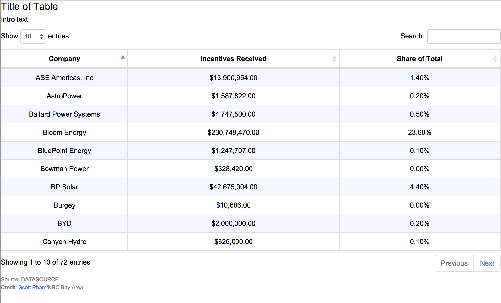
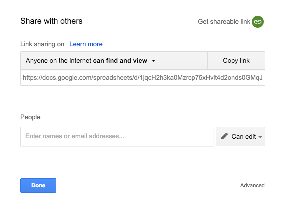

##Create a Searchable Table With a Google Spreadsheet

This repo creates bootstrap-styled searchable, sortable, responsive tables using the very cool [Tabletop.js](https://github.com/jsoma/tabletop) and the [datatables jquery plugin](http://datatables.net/).

It's an update of [Chris Essig](https://twitter.com/CourierEssig) and [Chris Keller](https://twitter.com/ChrisLKeller)'s super useful [datafeed to datatables](https://github.com/chrislkeller/projects.chrislkeller.com/tree/master/demos/datafeed_to_datatables) repo. Keller's template still works great, but this version uses the latest version of DataTables and removes a lot of deprecated code. The bootstrap implementation is also a little simpler and easier to read here.

[Click for a live demo](http://scottpham.github.io/tabletop-to-datatables/)


##Setup
- First get your data in a google sheet. I like to shorten the column headers to one word each for simplicity, but it's not strictly necessary.

- You'll need to make the sheet fully public by "publishing" _and_ sharing the sheet with the public. You must do both or the table will not work! To publish the sheet, go to the `File` menu and selected `Publish to the web.` To 'share' the sheet with the public, hit the share menu and select 'Anyone on the internet **can find and view**'



- Then grab the url of the spreadsheet or the "key" from the URL. That's the long string of numbers in the middle of URL. Either one is fine.

- Open `js/graphic.js` and put the key you just copied in the very first variable in the third line of the code:
```
var key = "1jqcH2h3ka0Mzrcp75xHvlt4d2onds0GMqJzsRvgwcyI";
```
- Next you'll want to edit the second variable, `columns`. This variable contains two key/value pairs for each column in your google sheet. The default has an arbitrary three columns with three arbitrary names.   

		var columns = [
	    { "data": "manufacturer", "title": "Company" },
	    { "data": "incentivesreceived", "title": "Incentives Received" },
	    { "data": "total", "title": "Share of Total" }
	  ];

Add or delete lines to match the number of columns in your google sheet.  The `"data"` value is the name of your column in your google sheet. Tabletop will strip out spaces and uppercase letters, so if your sheets column is "State Governors" you would write "stategovernors" in for `"data"`. If your google sheet has column names that begin with numbers or contain punctuation, datatables will throw an error.

The `"title"` value should be a string formatted how you'd like it to appear in the published datatable. If you had to remove important punctuation in the google sheet you can put it back here.

- And that's enough to publish a datatable! I've wrapped the DataTable in some HTML with sensible CSS, so you'll want to edit `index.html` to add a title, intro graf, source and credit.

##Further Customization
- Some extra DataTable options are included in comments.

		//Initialize the DataTable object and put settings in
		$("#mySelection").DataTable({
			...
				//uncomment these options to simplify your table
				//"paging": false,
				//"searching": false,
				//"info": false
			});
			}
		});

The defaults are pretty fully featured, so you're more likely to want to remove options. `"paging": false` removes the paging buttons. `"searching": false` removes the search box and `"info": false` removes the "Showing X of Y Entries" text at the bottom of the table.
More options are available from the [DataTables API](http://datatables.net/reference/option/).

- For general styling, use [Bootstrap CSS table classes](http://getbootstrap.com/css/#tables) and add or remove them here:

       $('#graphic').html('<table cellpadding="0" cellspacing="0" border="0" class="table table-condensed table-bordered table-striped table-hover" id="mySelection"></table>');
